# Summary of Access Control Security

## 1 	Overview Access Control and Reference Monitor  

- AC is traditional center of gravity of computer security
- Where security engineering meets computer science
- Function: controls which principals (persons, processes, machines,…) have access to which resources in a system
- Einordnung von ACS in der ACM Digital Lib

  - Computing Classification System (CCS) $\rightarrow$ Security & Privacy $\rightarrow$ Security Services $\rightarrow$ Access Control
- **Reference Monitor**
  - Scenario:

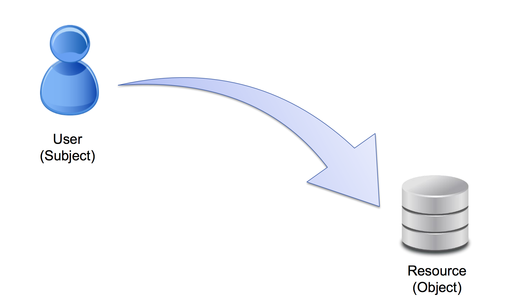

​	Access Control: 

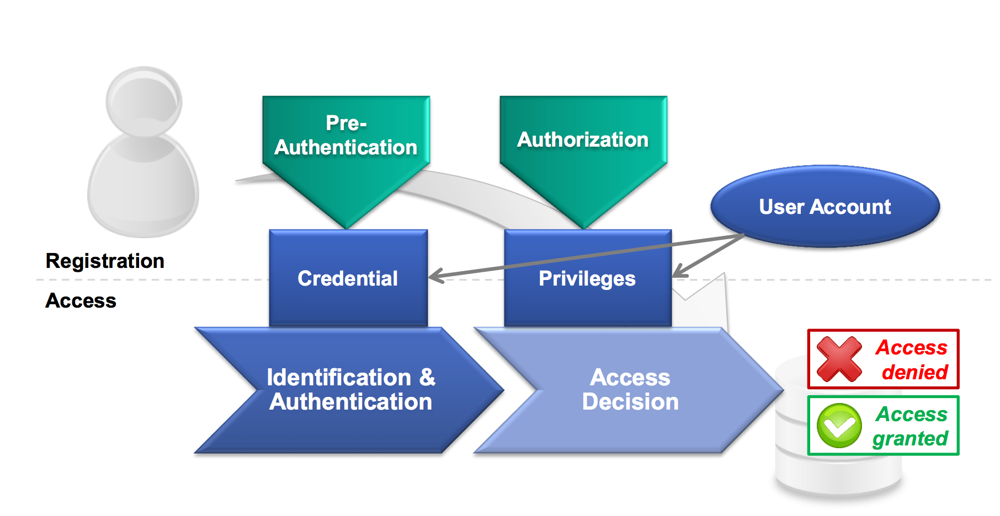

- **Access Control Matrix**
  - Möglichkeit zur Umsetzung von Identitätsbasierter Zugriffskontrolle zum Zeitpunkt **t**
  - **Zeilen der Matrix**: beschreiben Principals
  - **Spalten**: Beschreiben Ressourcen
  - In Zellen stehen Rechte, welche ein Subjekt auf eine Ressource erhält
  - **ABER**: In der Praxis wenig geeignet: Datenstruktur sehr ineffizient $\rightarrow$ ACM ist groß, aber dafür sehr dürftig

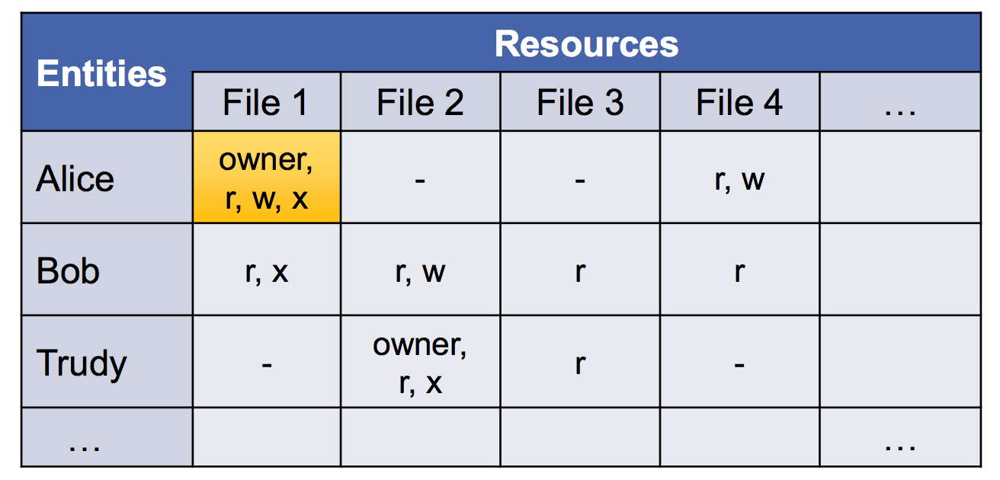

- **Capability Lists (CLs)**
  - Implementierungsmöglichkeit
  - Subject-oriented View: Access privileges are stored together with the subject (rows are stored)
  - Only few implementations (e.g. from IBM) $\rightarrow$ determining all access privileges on an object is expensive $\rightarrow$ determining and delegation of access privileges is easy for single entities 

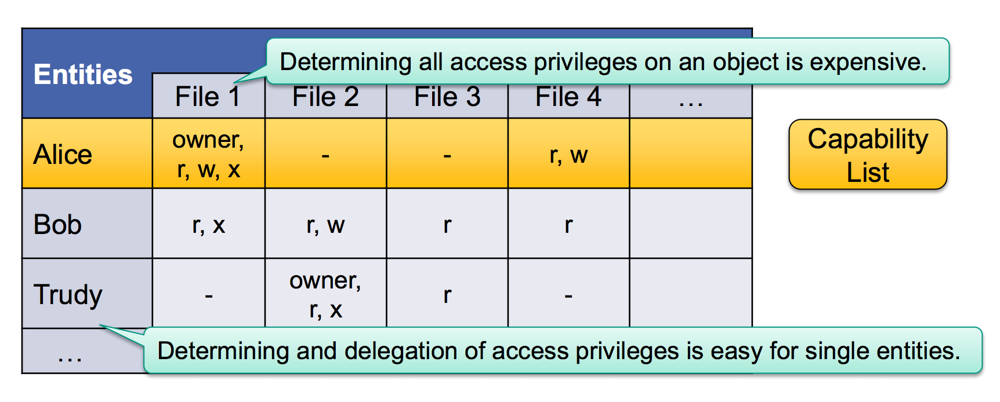

- **Access Control Lists (ACLs)**
  - Implementierungsmöglichkeit
  - Object-oriented view: Access privileges are stored together with the object
  - Gegensatz zu CLs
  - Determining and revoking of access privileges can be implemented efficiently $\rightarrow $ Determining all privileges of an entity can be expensive
  - Used by common systems

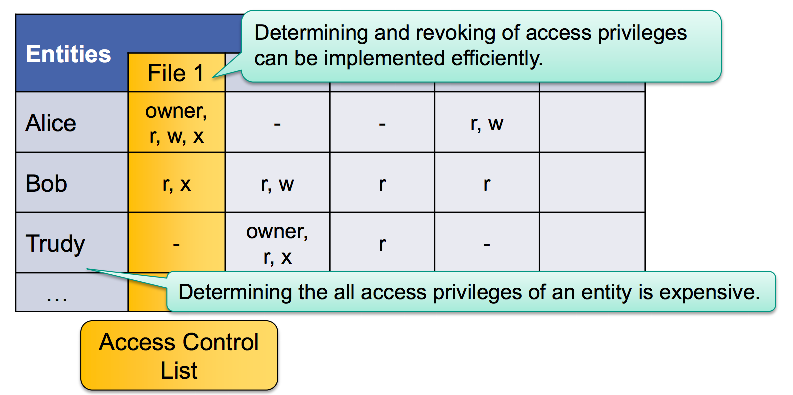

- **AC Strategies and Methods**

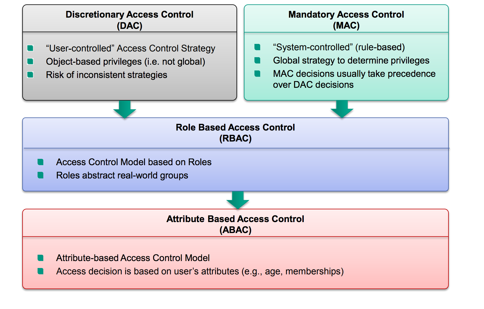

- **Access Control Complexity**

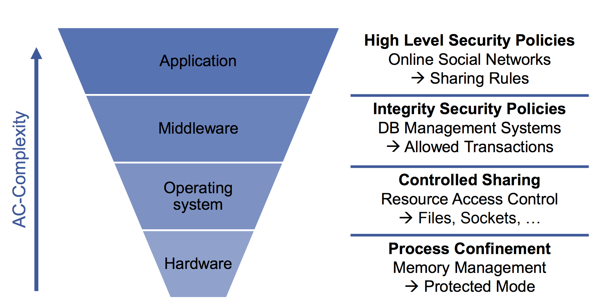


- **OS Access Control**

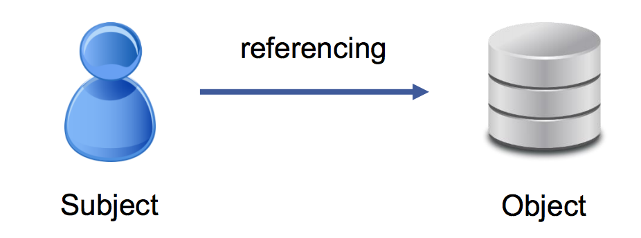

- Subject = Process executed on behalf of a user
- Object = Resource (File, peripherals, memory, ...)
- Goal: Controlled sharing of resources
  - Execution control -> Intercept accessing of resources
  - Authorization Mechanism -> Verify access regarding security policy

$\rightarrow$ Reference Monitor Concept

- **Reference Monitor**

  - Implementation has to comply with:


  - Evaluable
    - small enough to be subject to analysis
  - Always invoked
    - no alternative access control method
  - Tamper-proof
    - Mechanism cannot be altered

- Erweitertes Konzept:

  - Authorization DB
    - Authorization Informationen 
  - Monitor Interface
    - Set of controlled operations
  - Audit trails
    - Traceability of access decisions

- **Security Kernels**

  - single most often used technique for building highly secure OS
  - But does not mean that it is always in all security systems or that most people agree that the security kernel is the right way to go
  - Opinion of most researchers: wrong approach
  - But to date has shown more promise than any other technique

- **Hardware Support**

  - Problem: prevent processes to override each others code/data

  - Architecture specific mechanisms:

    - Hierarchical protection domains 

    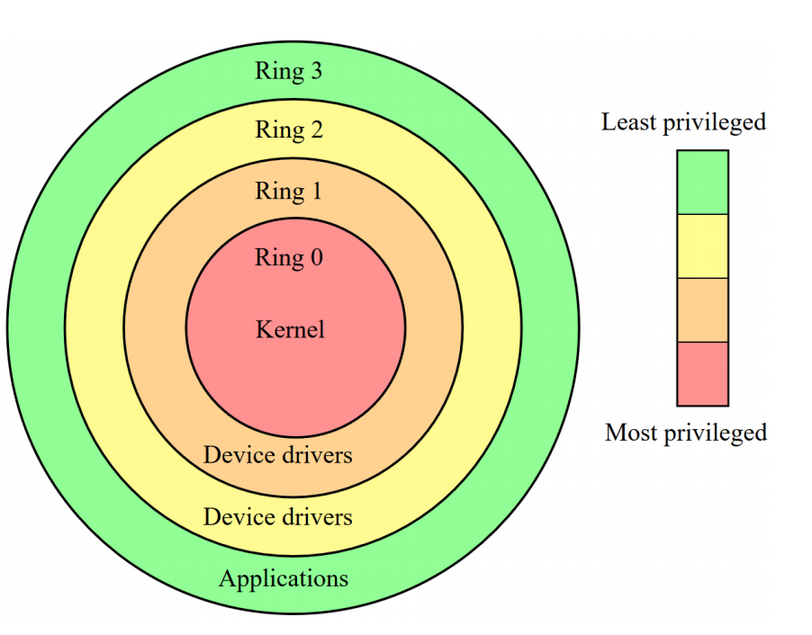

    - Segment addressing

    - preemtive multitasking

  - -> visualize resources

  - Windows 7 uses only two of four rings

    - Kernel mode = 0
    - User mode = 3


Implementing OS-Level Access Control using a RM, the OS as well as HW is required to provide according primitives.

- **Software: Linux**
  - Linux = POSIX reimplementation -> insufficient security mechanisms
  - Variaty of extensions: implementing different AC Models proposed for upstream integration
  - Linux security Modules (LSM)
    - Hooks = Reference Monitor Interface
    - Kernel Module = Reference Monitor Implementation
  - Examples for Implementations: AppAmor, SELinux, Smack, TOMOYO, Yama, ...
- Linux Security Modules


- **Extended Hardware Support - Intel SGX**
  - Traditional ring approach protects:
    - os from apps
    - Apps from each other

  - -> A single OS vulnerability may corrupt the whole system

  - Intel Software Guard Extensions (SGX)
    - Set of extensions to intels architecture
    - Goal: aims to provide integrity and confidentiality guarantees to security-sensitive computation performed on a computer where all the privileged software (kernel, hypervisor,…) is potentially malicious

  - SGX = 'reverse Sandbox' -> prtecting apps from system

  - **Enclave** = HW-protected memory region
    - may contain executable code & data
    - runs subset of instructions (e.g. no syscalls)

  

- **Unaddressed attack vectors**

  - cache timing attacks

  - microcode attacks

  - physical attacks

    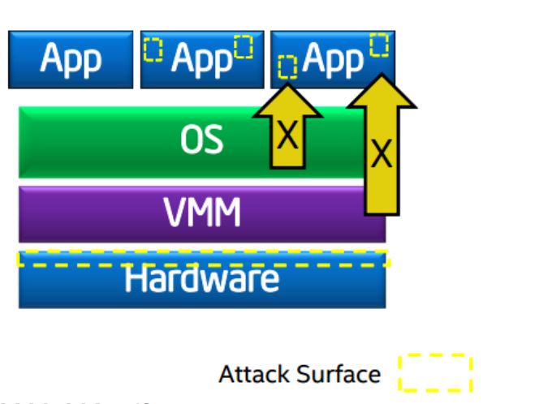

- HW-enforced Security requires:

  - trusted computing base
  - HW secrets
  - remote attestation
  - Sealed storage
  - memory encryption

- Warnung:

  - Intalling enclaves requires intels license
  - Enclaved SW cannot be analyzed or monitored

- possible use cases for Intel SGX

  - Numecent -> Digital Rights Management (DRM)
  - Synaptics -> Biometric Matching 
  - Bromium -> Password Manager

### Summary

- To implement a RM a trusted computing base is needed. IN ease of os-level AC this requires software primitives (e.g. LSM) as well as Hardware support (e.g. protection rings).
- A common approach for OS-level Access Control implementations are Security Kernels, aiming at a reduction of the attack surface.
- Recent development: Intel SGX implements secure enclaves to run code in potentially malicious environments while providing integrity and confidentiality guarantees.

#### Further Reading

- How to switch from real mode to protected mode after bootloader?
  - https://stackoverflow.com/questions/36968829/how-to-switch-from-real-mode-to-protected-mode-after-bootloader
- LSM – Static Analysis of Authorization Hook Placement
  - http://www.cse.psu.edu/~trj1/papers/usenix_sec2002.pdf


## 2 Access Control Matrix

- Commands

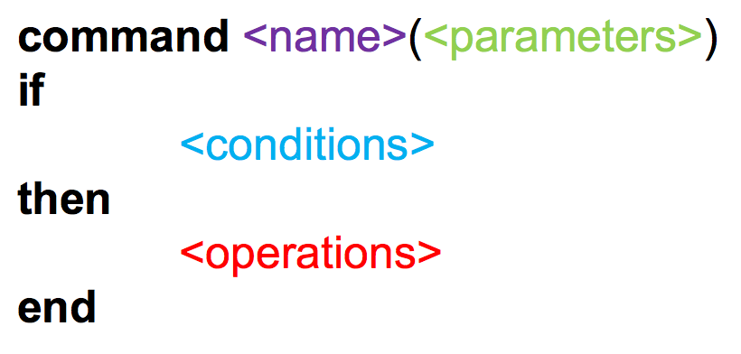

- - Create file

```
command make.file(p, f)
	create object f;
	enter own into A[p,f];
	enter r into A[p,f];
	enter w into A[p,f];
end
```


- Grant Rights to File

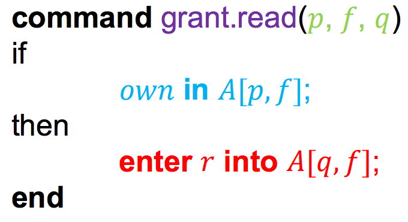


## 3 RBAC and Role Mining

## 4 Attribute based Access Control (ABAC)

- **ABAC**

  - A logical access control methology where authorisation is determined to perfomr a set of operations by evaluating attributes associated with the subject, object, requestd operations, and, in some cases environment conditions against policy, rules or relationships that describe the allowable operations for a given set of attributes*

  ​

  ​	*Source: NIST Special Publication 800-162: Guide to Attribute Based Access Control 	
  ​		(ABAC) Definition and Considerations, 2013

  -  Current status
  -  Architecture
  -  Formal definition
  -  Combination with XACML

- Deployment

  - 4 phases to ABAC
  - Attribute assuranceDelegation

- Delegation

  - Challenges with the flexibility of ABAC


XACML - Policy Structure 

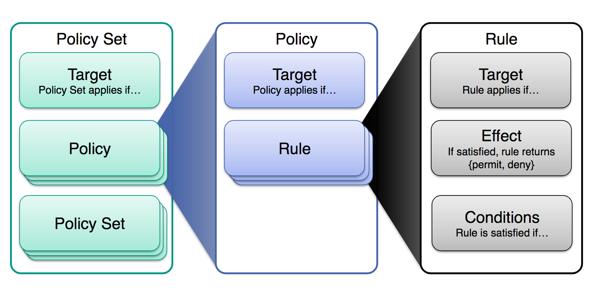

XACML components: Policy Enforcement Point (PEP), Policy Decision Point (PDP), Policy Administration Point (PAP), Policy Information Point (PIP)

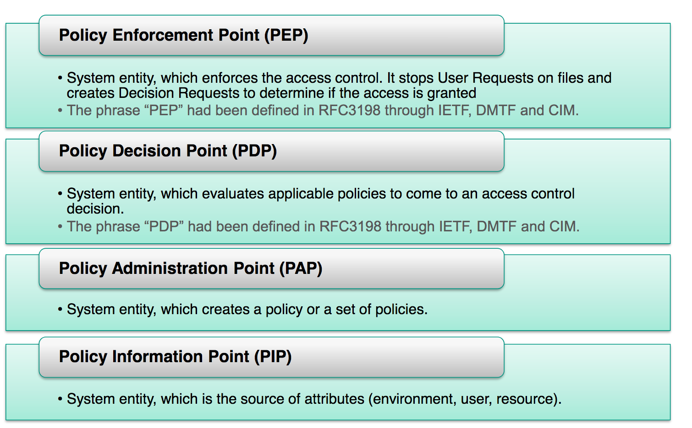


XACML- Flow

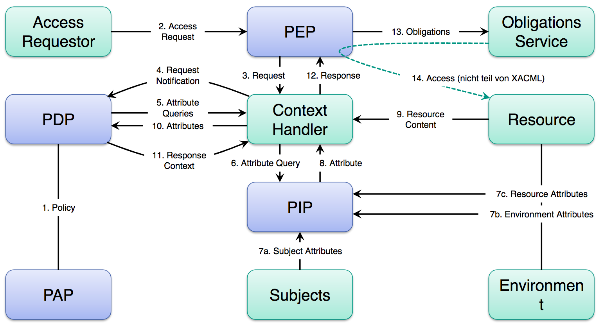


http://www.webfarmr.eu/2010/09/xacml-101-a-quick-intro-to-attribute-based-access-control-with-xacml/


Access Control Models

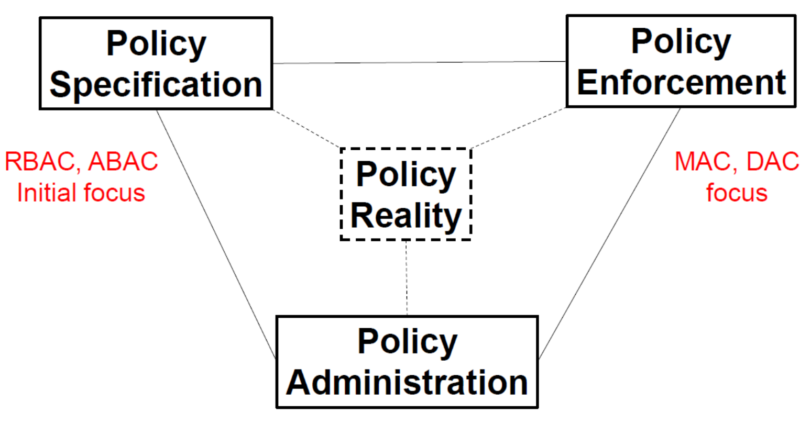


Authorization Leap

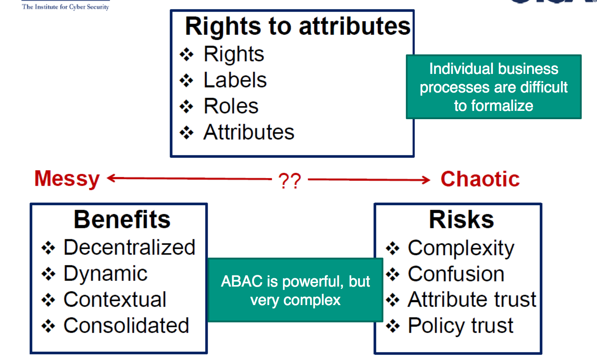


ABAC Architecture


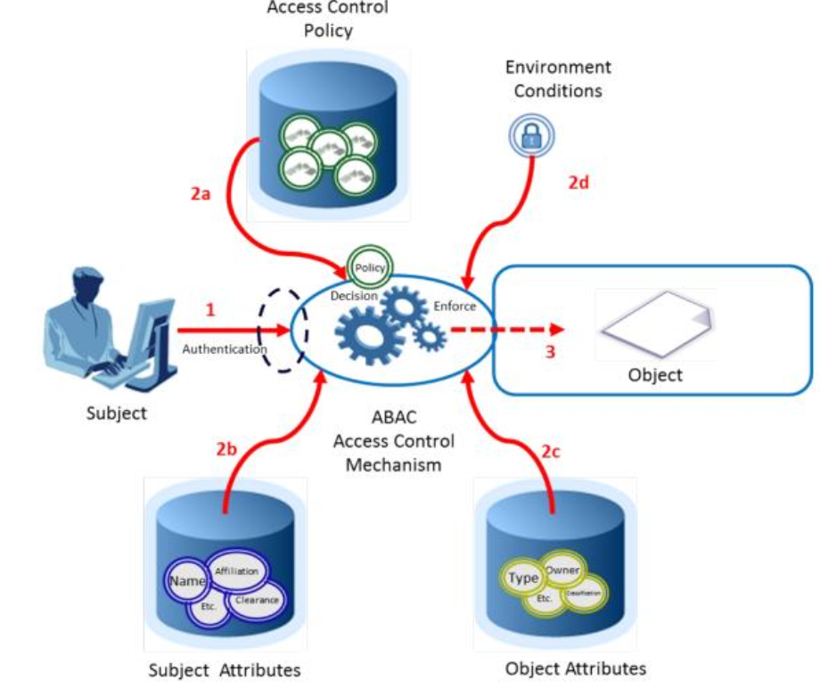


#### Delegation

Delegation enables a user to temporarily and dynamically alter the design of an access control system after policies have been created to account for everyday changes that policies are insufficient (mangelhaft) to address.

3 Components:

- Delegator (Who is doing the delegating?)

- Delegatee (Where are the elements delegated to?)

- Delegated access right (what is beeing delegated?


In contrast to DAC, MAC, RBAC in ABAC systems Delegation is more complicated, because we can not only delegate permissions, but also attributes (identity less access control)
- Forms of Delegation:
  - Attribute Delegation (analogy: give someone your keycard to open a door)
  - Permission Delegation (Give someone's keycard the permission to open the door)
  - Group membership delegation 


Issues of Delegation:
-  Attribute Delegation: easy to implement and to use but very complex; maybe many unexpected attributes in system
-  Permission Delegation: very complex to implement because more system knowledge is necessary; harder to set up; No unexpected or undefined attribute sets due to no attribute delegation

## 5 Relationship Based Access Control (ReBAC)
- Access Control based on social relationship

- Unterschiede zum klassischen AC
  - policy individualization
  - User and Resource as a Target
  - User policies for outgoing and incoming actions

- Model Components:

  - Data Model

    - Directed Graph (Nodes U = Users, Edges R = Relationships)

  - Policy Description Language:

    |                 | Data Model                               | Policy Description Language              |
    | --------------- | ---------------------------------------- | ---------------------------------------- |
    | Expressiveness  | Should model relationship between users, and users & resources | Common Policies should be  expressible   |
    | Performance     | Should be efficient to process           | Evaluation of policies should be fast    |
    | Maintainability | changes to relationship should be frequently made | -                                        |
    | Usability       | -                                        | Policy should be easy to understand, create and maintain |


- Access req can be seen as a triple <$u_a$ , action, target> 
  - $u_a$ accessing user
- Conjuntion and disjunction of policies are possibilities for policy conflict resolutions
- Policy Specification
  - operate on the user graph
  - operate in most cases on path between u_a and u_t
  - Specification with multiple relationship types (friends, coworker)
    - ff and fc
    - e.g. Using regex: $ff\wedge \neg fc$ means 
      - friends of friends should see my pictures, but not if they are also a coworker of one of my friends
        - -> Expensiveness - Regex based on policy description is expensive
        - -> Performance - Social graphs can be really large and can be DoS Vulnerable
        - -> Usability - most users are unable to use correctly Facebook's privacy selection
- Combinations of ABAC and ReBAC possible: Node attributes and Edge attributes
- Algorithms in access control operate on data:
  - RBAC: roles, users, permissions and mappings
  - ABAC: attributes , users, permissions and mappings
  - ReBAC: Usergraph + X (Path traversal algorithms)

## 6 Values

- **Value**: What a person or Groupon of people consider important in life.
- **Norms**: Prescriptions/restrictions on action
- **Design Requirements**: technical properties of the considered system  
- Encoded in Law: Life, Liberty, Privacy (protection of personal data)
  - Grundgesetz: Menschenwürde, Freie Entfaltung der Persönlichkeit
- Value-Sensitive Design (VSD)
  - Goal: account for human values in a principled and comprehensive manner throughout the design process
  - Tripartite methology
    - Conceptual investigations
    - Empirical investigations
    - Technical investigations
  - Combination of all three: evaluation/selection of a system design according to stakeholders

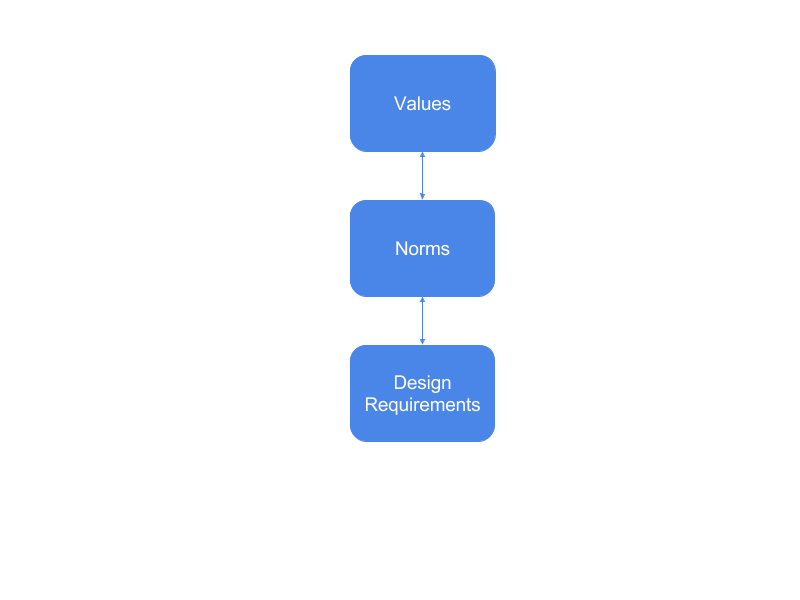

- ​

  - Upwards: design requirements can adhere to or violate norms, norms can support or hinder valuesUpwards: design requirements can adhere to or violate norms, norms can support or hinder values
  - Downwards: norms specify values, design requirements specify or implement norms
  - Design process can be performed **top-down** or **bottom-up** or **both**
  - Mapping to OM-AM

  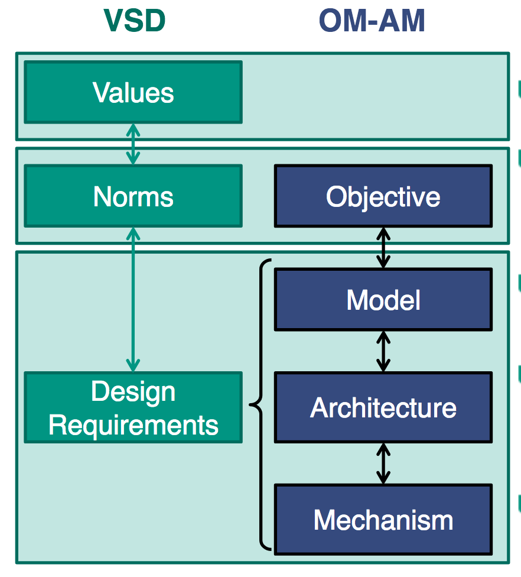

  - **Objective**
    - e.g. no unauthorised access
  - **Model**
    - Mathematical formalization of the objective, e.g. RBAC
  - **Architecture**
    - Logical components (e.g. auth/authoriz. servers) and interdependencies
  - **Mechanism**
    - Protocol and software implementations e.g. OAuth
  - OM-AM enables closer specification of "design requirements"


- "Private sharing"
  - Use case: A resource owner (RO) stores data at a storage provider (SP, eg Dropbox) and grants access to certain clients
  - Design decisions:
    - Authentication performed by an IdP, SP or RO?
- Decision making in Value-Sensitive Design
  - Basis for comparison 
  - Decision making under value conflicts and tradeoffs
    - Cost-benefit analysis
    - Direct trade-offs
    - Maximin
      - Maximize the value with the lowest measurement
    - Satisfaction 
    - Judgement
    - Innovation
  - Relationship to well known mathematical problems 
- Value-Scoring


#### Summary

- Impact of access control systems on many aspects of life
- Value notions
- "Value, norms, design" requirement framework
- Mapping to OM-AM framework
- Handling of value conflicts trade-offs
- Example of basic decision making in value-sensitive design
- **Challenges** 
  - Clarification of terms: what is meant by "safety" $\rightarrow$ requires discussion among stakeholders
  - Value commensurability, e.g. linear relationship between value units? How to handle diminishing returns, thresholds, incompatible design requirements?
- Still:
  - Systematic approach clarifies the (typically implicit) value judgments made in the design of access control systems


## 7 Cloud 

- **AC in Cloud Systems**

  - Cloud computing is a huge market (75% of surveyd companies have a significant amount of their IT in the cloud already)
  - Cloud env bring their own set of requirements and usage scenarios
  - Environment: *Customisable Access Policy Groups, System Admins, Cloud Apps*  
  - **Problems**
    - Can we use RBAC? -> No:
    - Cloud resources and services tend to be very dynamic, due to the ease of service deployment (Software-as-a-service)
    - Variety of trusted domains offer a variety of services (even in different countries with different set of laws)
    - Sharing resources among potential untrusted tenants
    - Mechanism to support the transfer of customers credentials to access services and resources 
    - -> ABAC? No, complexity is already difficult to handle in a closed system
  - **Requirements**
    - 2014 collected by Younis (but still pretty vage)
    - Dynamic performance and mobility features
    - Trust
  - **Solutions**
    - AC3
    - HASBE
    - Some approaches, like DAC-MACS implement cryptographically enforced ac, which belong to the area of Secure Data Sharing
    - Solution is somewhere between RBAC and ABAC located

- **A quick look into the on-premises ACS used at KIT**

  - **Directory Services**

    - special purpose directory for naming
    - quieries based on attributes
      - Compare: DNS req
      - Example: yellow pages
    - *X.500* traditional dir service
    - *Lightweight Directory Access Protocol* (LDAP)
    - Example for X.500 & LDAP
      - Basic data set in database directory: (Attribute, Value)-Pair
      - (Organisation, Karlsruher Institut für Technologie), (OU, Telematik), (Name, Max Mustermann), (EMAIL, maxmustermann@kit.edu)
    - A Data set can also be a container to reference other directories or data sets -> hierarchical order

  - **LDAP**

    - Defines objects and their attributes as well as formats and the hierarchical order of elements
    - Comparable to the schema of SQL databases

  - **Foundations of Active Directory (AD)**

    - 95% of the Fortune 500 companies use AD in some kind of way

    - Umbrella title for many different services

    - *Main Parts*:

      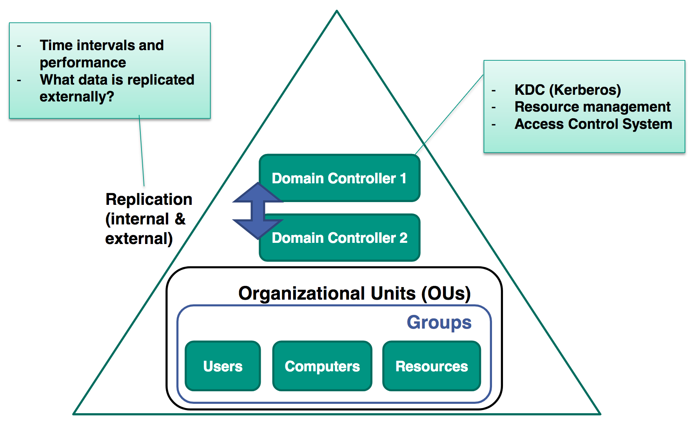

    - Domains and Trusts

    - Forests

    - Sites and Forests

    - Operation Master Roles

      - Forest Level (1 per forest)
      - Domain Level (1 per domain)


  - **Limitations of local AD**
    - AD designed for internal on premise environment
    - Can only be connected to outward services either fully open or fully manual (both undesireable in cloud env)
      - fully open: information in many cases critical and cannot be shared with other services
      - Fully manual: Cloud envs are too dynamic to set up every access right to any resource within AD
      - Identity Federation, SSO and many req can be only realized poorly

- **Windows Azure Active Directory**

  - **Overview**
    - Implemented as a "road toward the Azure cloud"
    - Works as a mediator between AD and Cloud  services -> makes it easier for businesses
    - Internal architecture changed significantly from a single hierarchy to a module-based framework
  - **Dynamic group members**
    - Some ABAC features for an RBAC model
    - Can be used like normal groups, but members are dynamically selected based on rules
    - $\rightarrow$ Enables ABAC to a certain degree, without adding too much complexity
    - Only user attributes available (no object or environment attributes), therefore also no attribute authority is needed, since the AD schema already defines all user attributes 
    - Sample rules: 
      - (user.department -eq "Sales") -or(user.department -eq "Marketing")
      - (user.department -eq "Sales") -and -not (user.jobTitle -contains "SDE")


## 8 Digital Rights Management (DRM)  		

- **Digital Rights Management**

  - **Relation to access control: conditional access systems**

    - Urhebergesetz §52a VGWort

    - Protects the tangible or fixed expression of an idea -> NOT the idea itself!

    - Author/Creator can claim copyright if the two conditions are fulfilled:

      - proposed work is original
      - Idea is put in a conrete form (hard copy like paper, software, mulitmedia)

    - In Contries with the Bern conventions it is automatically assigned to newly crated works

    - DRM refers to controlling and managing digital intellectual property rights

    - Holders of digital rights should be clearly identified and should get the stipulated payment for their work

    - Components: *Clearinghouse, Consumer, Distributor, Content provider*:

      ​

    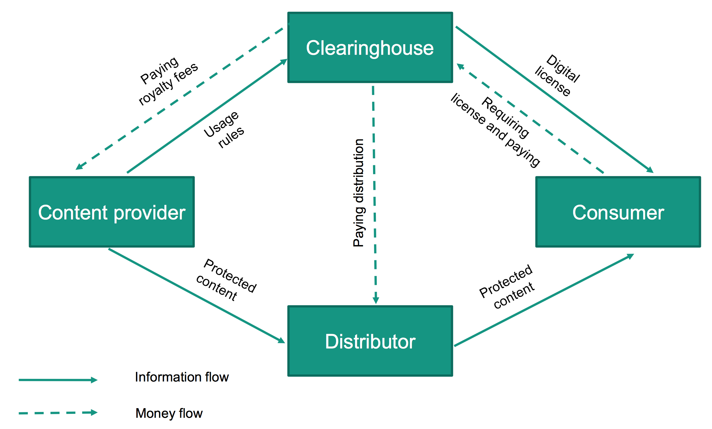

  - **DRM architecture**

    - **Roles**: *Rights Holders*, *Service Providers*, *Customers*

    - **Services**: *Identity Management, Content Management, Rights Management*

    - **Functions**: *Security/Encryption, Authentication/Authorization, Billing/Payments, Delivery*

    - Example: Microsoft PlayReady

       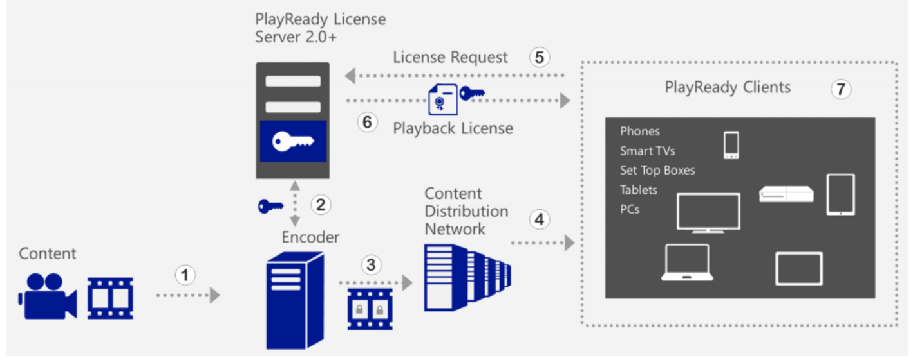

           1. Content is encrypted
           2. Encrypted key is available to the license server
           3. content is staged for delivery
           4. Client discovers content
           5. To encrypted content client sends a license req to license server
           6. Server authenticates client and sends license back to client
           7. Clients plays unencrypted content back according to policies defined in license  

- Usage control

  - generalization of access control

  - Covers:

    - Authorisations
    - Obligations
    - Conditions
    - Continuity 
    - Mutability

  - UCON model

    - provides family of core models for usage control 

    - Park/Sandhu $UCON_{ABC}$, 2004

       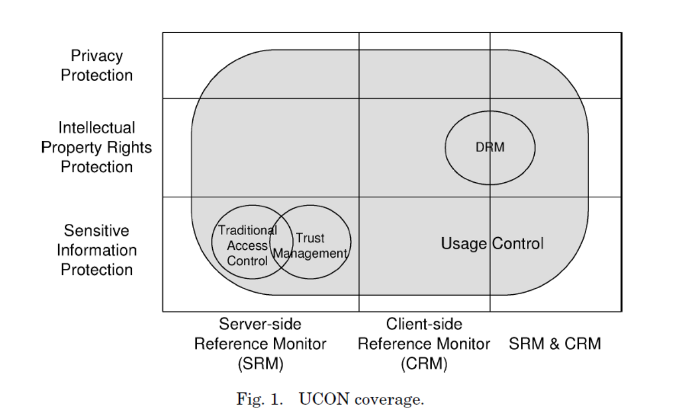

  - UCON vs traditional Access Control Models

    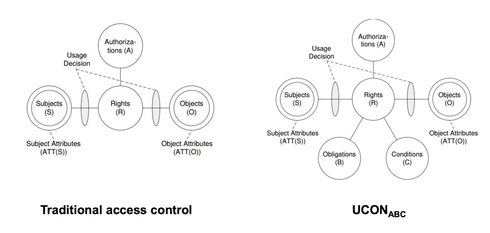

    ​

  - There are familiar concepts at $UCON_{ABC}$ to attribute-based access control

  - Components of UCON

    - Subjects (S) and Subject attribute (ATT(S)): *S=user, ATTS={user_group}* 
    - Objects (O) and Object attribute *(ATT(O)): O=file, ATTO={security_level}*
    - Rights (R): R=read
    - Authorizations(A): preA and onA
    - Obligations(B): preB and onB
    - Conditions(C): preC and onC

  - **Administrative model**

    - Distinguishes between providers, consumers and Identify subjects -> Baseline setup for IoT scenarios
    - Mutable attributes are modifiable as a consequence of subject's actions and do not require any administrative action for updates (unlike immutable attributes).
    - $UCON_{ABC}$ model seperates core models from administrative issues


​	

## 9 The Internet of Things - IoT

- **Motivation**

  - Devices often operate in "untrusted environments" (mobile, cloud, IoT, IoE)

- Securing the Internet of Things is very important

- Problems: Vehicle hacking, hacking smart buildings, printing and copiers

- Embedded devices, safety relevant, critical infrastructures

- Issues: Authenticity and integrity 

  - change in scale, criticality complexity 

- **Smartcards**

  - ISO 7816 - Identification cards
  - ISO 14443 - contactless integrated circuit cards
  - Memory cards

  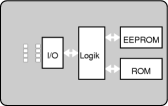

  - Microprocessor cards

    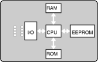

  - Example: Mifare Classic (known hack on it)

  - Typical security features

    - Tamper proof design:
      - Manual chip layout
      - Mechanisms against various attacks
        - physical attacks of various forms
        - freezing the device
        - applying unusual clock signals
        - inducing software errors using microwaves
    - PIN/PUK mechanisms
    - Access Control for file system

- How to establish trust in "untrusted environments" -> Trusted Computing (TC)

- **Trusted Computing**

  - A technology which is taken from the field of trusted systems where the computer will consistently behave in expected ways 

    - Behavior will be enforced by hardware and software
    - Behavior is archieved by loading the hardware with a unique encrypted key
    - the encrypted key is unaccessable to the rest of the system
  - Controversy: 
    - hardware is not only secured for its owner -> also secured against its owner
  - Key concept:
    - Endorsement key -> chip gets identity
    - Secure input/output -> hinders attacks like key-stroke loggers and screen scrapers
    - Memory curtaining /protected execution -> strong memory isolation
    - Sealed storage -> allows software to keep cryptographically secure secrets
    - Remote attestation -> software gets identity

- **Access control in vehicles**

  - Connected with personal devices, other cars, road operators

  - various wireless interfaceses

  - Simplified accessibility by attackers

  - Example Hack: Jeep Cherokee

    - remote attack against unaltered vehicle (braking, steering, ...)
    - Injection of CAN messages
    - wireless remote access
    - Recall of 1.4 Million vehicles
    - But still vulnerable to local attacks

  - Further examples:

    - BMW Connected Drive
      - unauthorized door opening
    - Corvette-SMS-Hack
      - Via insurance telematics system
    - Engine immobilizer, Tesla Model S, General Motors "OnStar"

  - Coarse grained view:

    - Protection against external attacks
    - Protection of personal data

  - Challenges

    - Extensive (wireless) interfaces

    - Vehicle IT has historically evolved 

    - Interaction with its environment -> which information should we trust?

    - Communication between vehicles

- **Intra-vehicle Networks**

    - requirements
        - Confidentiality , integrity, availability, authenticity, non repudiation, privacy

  - Architecture 
    - Multitude of different bus systems & protocols
    - connected to each other via a central gateway
    - remote access possible

  - Achieving security
    - Hardware Security Modules (HSM)
      - requirement: Security must not be a bottleneck

- **Security in inter-vehicle networks (C2X)**

  - Two issues of security: Cost and privacy 
  - Possible attacks: Bogus Attack, DDos, Interception, ...
  - Security goals: Integrity, Availability, Authenticity, ...

    - However: Confidentiality generally not
  - Ensure integrity and trustworthiness of C2X messages for digital signatures
  - Asymmetric crypto
  - Approaches for communication:

    - Outgoing transmissions are signed and a certificate is attached

    - Idea: Use of pseudonyms

      - Time limited - prevents location tracking

      - Uniqueness - avoid multiple vehicles with same pseudonym 

      - Availability - possibility to store plenty of pseudonyms locally
  - Lifecycle of pseudonym
      - Issuance -> use -> change -> change -> resolution -> revocation
  - Cost of security - payload: Sum 255 Bytes transmission overhead


##10 Secure Data Outsourcing & Access/Pattern Confidentiality 		

- Cryptographically enforced Access Control
- Example: Secure Data Outsourcing 
  - Motivation
  - Challenges 
- Access Pattern Confidentiality
  - Information Leakage
  - Proposed Protocols: ORAM and Burst ORAM
- Our research: ORAM for Databases 
  - PATCONFDB
  - Issues with multiple indices


## 11 Secure Data Sharing

- Challenge: Secure Data Sharing
  - Key management
  - Revocation
- Shared Cryptographic File Systems
  - SiRiUS
  - Boxcryptor 2.0
- Discussion:
  - The price of secure data sharing (performance)
    - Abstract representation via key graphs?		


## 12 Blockchain and Bitcoin

​		
​				
​		
​	